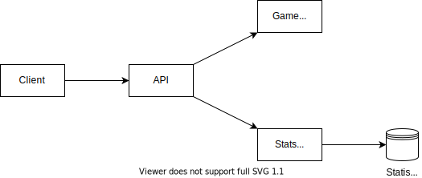

# High Level Design

## Overview



## API

### Board view

A data structure that represents the current board state, hiding any information that an actual player would not be able to see in a physical game. For example:

```json
{ 
    "hashcode": 12133142, 
    "nextPlayer" : 0,
    "winner" : 2,
    "bricks0" : 5,
    "bricks1" : 3,
    "lastMoveHashcode" : 16170,
    "stacks" : [
        { 
            "id" : 3,
            "hashcode" : 27,
            "count" : 3,
            "top" : 0,
            "canProvide" : false
        },
        { 
            "id" : 5,
            "hashcode" : 63,
            "count" : 3,
            "top" : 1
        },
        { 
            "id" : 6,
            "hashcode" : 1,
            "count" : 1,
            "top" : 1
        },
        { 
            "id" : 8,
            "hashcode" : 1,
            "count" : 1,
            "top" : 1
        }
    ]
}
```

### Create a new game

Creates a new board, takes as input who's going to play first (0 or 1) and returns a board view object.

### Play a move

Takes as input a slimmed-down board view object, an origin id, a destination id and returns the new state of the board as a board view object. The slimmed-down board view input object could look like this:

```json
{ 
    "hashcode": 12133142, 
    "nextPlayer": 0,
    "stacks" : [
        { 
            "id" : 3,
            "hashcode" : 27,
        },
        { 
            "id" : 5,
            "hashcode" : 63,
        },
        { 
            "id" : 6,
            "hashcode" : 1,
        },
        { 
            "id" : 8,
            "hashcode" : 1,
        }
    ],
    "fromId" : 9,
    "toId" : 8
}
```

### Record Winning Statistics

Takes as input all of the board move hashcodes and the winning player. The input could look like this:

```json
{
    "winner": 0,
    "plays" : [
        {
            "board" : 287687112,
            "move" : 12133
        },
        {
            "board" : 564681102,
            "move" : 1133
        },
        {
            "board" : 5687659119,
            "move" : 8133
        },
        {
            "board" : 77787112,
            "move" : 12133
        },
        {
            "board" : 2781124090,
            "move" : 1003
        },
        {
            "board" : 11260700321,
            "move" : 100133
        }
    ]
}
```

## Data Model

The data to be stored accounts for the winning statistics, or the final consequences of each move from each board state, statistically speaking. Every time one match ends, we update the statistics for which player won tha match on all of the states and moves of the match.

### Consequences

| Key | Name | Type |
|:--:|:--|:--|
| PK | BoardHashcode | long |
| PK | MoveHashcode | int |
| | 0Win | int |
| | 1Win | int |

There should be a quick way to search (a.k.a. an index) for Board Hashcode + 0Win as well as Board Hashcode + 1Win. For writing, the useful index is Board Hashcode + Move Hashcode.

Since there doesn't seem to be a need for relationships between different tables, we should favor a NoSQL low-latency DB.
