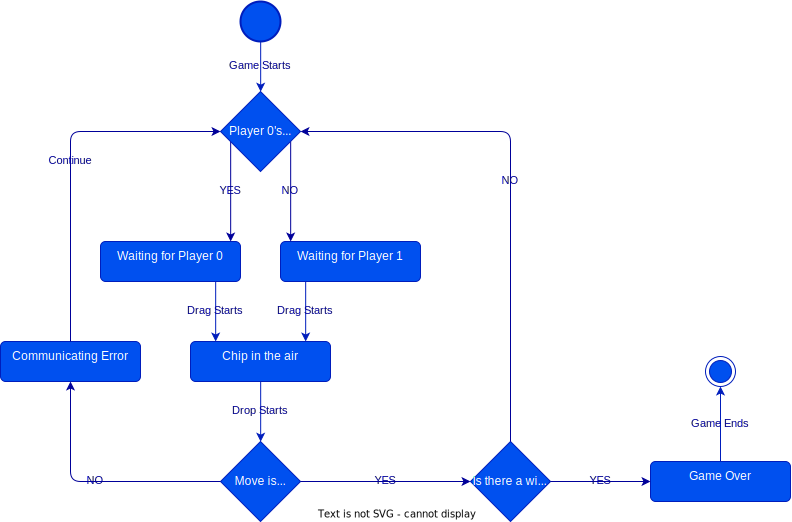

# Drag and Drop Mechanics

## Waiting for Player 0

|Stack|Can Drag|Can Drop|
|---|---|---|
|0-stash|If count > 0|NO|
|1-stash|NO|NO|
|stacks with 0|NO|NO|
|stacks with 1|If not blocked|NO|
|stacks with 2|If not blocked|NO|
|stacks with 3|If not blocked|NO|

## Waiting for Player 1

|Stack|Can Drag|Can Drop|
|---|---|---|
|0-stash|NO|NO|
|1-stash|If count(from) > 0|NO|
|stacks with 0|NO|NO|
|stacks with 1|If not blocked|NO|
|stacks with 2|If not blocked|NO|
|stacks with 3|If not blocked|NO|

## Chip in the air

|Stack|Can Drag|Can Drop|
|---|---|---|
|0-stash|NO|NO|
|1-stash|NO|NO|
|stacks with 0|NO|If count(from) > 1|
|stacks with 1|NO|YES|
|stacks with 2|NO|YES|
|stacks with 3|NO|NO|

## Communicating Error

|Stack|Can Drag|Can Drop|
|---|---|---|
|0-stash|NO|NO|
|1-stash|NO|NO|
|stacks with 0|NO|NO|
|stacks with 1|NO|NO|
|stacks with 2|NO|NO|
|stacks with 3|NO|NO|

## Game Over

|Stack|Can Drag|Can Drop|
|---|---|---|
|0-stash|NO|NO|
|1-stash|NO|NO|
|stacks with 0|NO|NO|
|stacks with 1|NO|NO|
|stacks with 2|NO|NO|
|stacks with 3|NO|NO|
